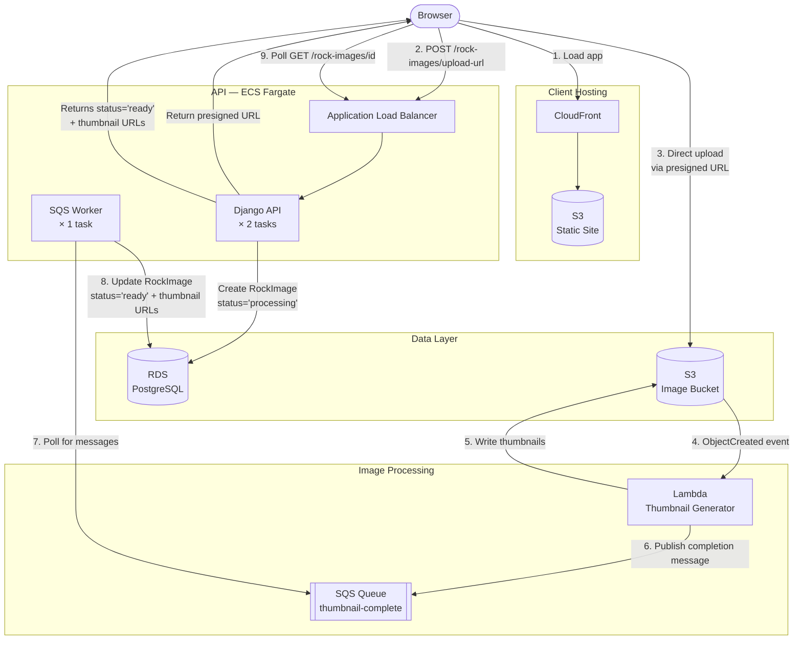

## The Approach We're Building

After reviewing the options as a class, we're going with **SQS** and a dedicated **worker process** running in ECS.

## What is Decoupling?

Two services are **tightly coupled** when one depends directly on the other being available. If Lambda called the API directly to signal completion, Lambda would need to know the API's URL, the API would need to be up and reachable, and a slow or failing API would affect Lambda's execution.

**Decoupled** services communicate through an intermediary — in this case, a queue. Lambda doesn't need to know anything about the API. It drops a message in the queue and moves on. The worker picks it up whenever it's ready.

This is a core principle of cloud-native design: services should be able to fail, scale, and deploy independently without affecting each other.

## Why SQS Over the Other Approaches?

| Approach | Coupling | Reliability | Complexity | Cloud-Native? |
|---|---|---|---|---|
| HTTP Callback | High | Low (no retry) | Low | Partial |
| Direct DB Write | Very High | Medium | Low | No |
| **SQS** | **Low** | **High** | **Medium** | **Yes** |
| SNS | Low | Medium | Medium | Yes |
| EventBridge | Very Low | High | High | Yes |
| S3 Polling | Low | Low | Low | No |

SQS hits the right balance: fully decoupled, durable, simple to reason about, and purpose-built for this producer/consumer pattern.

> **SNS and EventBridge** are other AWS messaging services you may not have encountered yet. SNS is a notification service that pushes messages out to multiple subscribers at once. EventBridge is an event bus that routes messages based on rules. Your instructor will walk through these during the class debrief.

## The New Architecture

Lambda publishes a message to SQS when it finishes. The worker — a separate ECS task running in the same cluster as the API — polls the queue, finds the message, and updates the `RockImage` record. The loop is closed.
