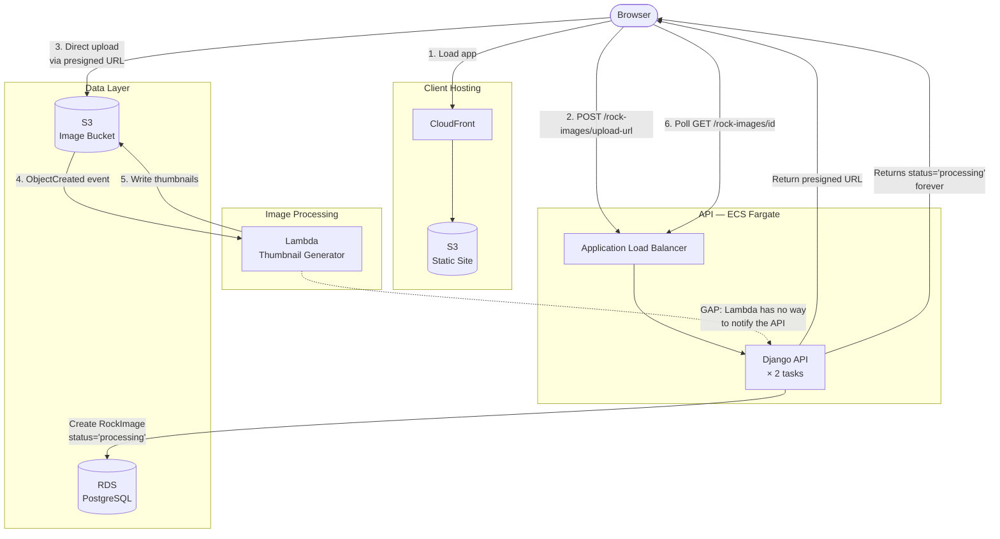

## What is System Design?

System design is the process of defining how the different pieces of a software system fit together — what services exist, how they communicate, where data lives, and how the system behaves under load or failure.

As systems grow beyond a single application, system design becomes one of the most important skills an engineer can develop. A well-designed system is easier to scale, easier to debug, and easier to hand off to someone new.

One of the most useful tools in system design is the **architecture diagram** — a visual map of the components in your system and the relationships between them.

## The Current Architecture

Here's a diagram of the Rock of Ages system as it stands today:

Each arrow represents data or a request moving between services. Notice the dashed arrow at the bottom: Lambda writes thumbnails to S3, but has no path back to the API. The `RockImage` record in the database is never updated.

## How to Read an Architecture Diagram

A few things to look for when reading or drawing a diagram like this:

- **Boxes** represent services or resources — things that exist and do work
- **Subgraphs** group related services together (e.g. everything in the API layer)
- **Solid arrows** represent real connections — data flows, API calls, event triggers
- **Dashed arrows** often represent gaps or intended-but-missing connections
- **Direction matters** — an arrow from A to B means A initiates the communication
- **Labels on arrows** describe what is being sent or what kind of action is happening

When you're debugging a distributed system, this kind of diagram is often the first thing you reach for. It helps you trace where a request enters the system, where it might get stuck, and which services are involved.

## Let's Diagram Together

Your instructor will lead a live diagramming session where the class maps out this system together. You'll identify the components, trace the flow of an image upload step by step, and talk through where the gap is and what might fill it.

Come ready to participate — there are no wrong answers. The goal is to build a shared mental model of the system before we start changing it.
