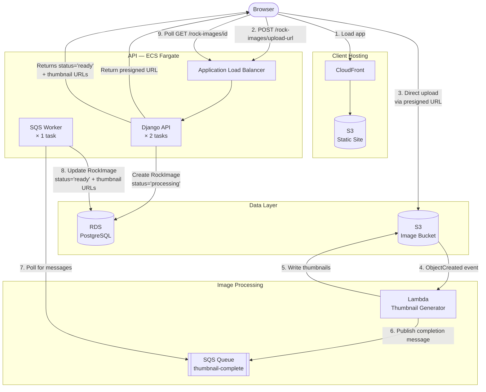

## What You Built

Over the course of this workshop you took an existing full-stack application and redesigned it to take advantage of the cloud — not just run on it.

Here's the system you built:

- A **containerized Django API** running on ECS Fargate, deployed and updated automatically via GitHub Actions
- An **S3-triggered Lambda microservice** that handles image resizing asynchronously and independently of the API
- An **SQS queue** decoupling the Lambda from the API so neither service needs to know about the other
- A **dedicated ECS worker** that polls the queue and closes the loop by updating the database when thumbnails are ready
- A **React client** deployed to S3 and served globally via CloudFront

Every piece of this system can be deployed, scaled, and updated independently.

## Principles You Applied

You didn't just follow steps — you applied real cloud-native design principles:

**Single responsibility.** The Lambda does one thing: resize images. The worker does one thing: consume the queue. Neither knows or cares about anything outside its own job.

**Loose coupling.** Lambda and the API never talk directly. They communicate through a queue, which means either service can be down, redeployed, or replaced without affecting the other.

**Event-driven design.** Work happens in response to events — an image uploaded to S3 triggers Lambda, a message in SQS triggers the worker. Nothing polls unnecessarily.

**Independent deployability.** Each service lives in its own repository with its own CICD pipeline. A change to the Lambda doesn't require touching the API.

**Fault isolation.** If the worker goes down, the API keeps serving requests. If Lambda has a bug, users can still use the rest of the app. Messages queue up and get processed when the worker recovers.

## The Full Journey

Look at how far this application has come across the three workshops:

| Workshop | What You Did |
|---|---|
| Part 1 | Manually deployed the application to EC2 and S3 |
| Part 2 | Rebuilt that same deployment using Terraform — infrastructure as code |
| Part 3 | Redesigned the system itself to be cloud-native and distributed |

Part 1 and 2 were about getting an existing application into the cloud. Part 3 was about rethinking how the application is built to take advantage of what the cloud makes possible.

## Where to Go From Here

There's a lot more to explore. Here are some directions worth researching:

**Dead Letter Queues (DLQ)** — Right now, if the worker fails to process a message, it gets deleted anyway. A dead letter queue captures failed messages so you can inspect and retry them. [[AWS docs on SQS Dead Letter Queues]]

**Observability** — Logs are spread across multiple services now. CloudWatch can aggregate them, and tools like AWS X-Ray let you trace a single request across Lambda, SQS, and the worker. [[AWS X-Ray]] · [[CloudWatch]]

**Auto-scaling the worker** — The worker currently runs as a single ECS task. In production you'd scale it based on the number of messages in the queue — more messages, more workers. [[Application Auto Scaling with SQS]]

**Infrastructure destroy workflow** — You can spin all of this up, but can you tear it down cleanly? Adding a Terraform destroy GitHub Actions workflow is an important part of managing cloud costs. [[add link]]

**Private networking** — The worker currently runs with a public IP. In production it would sit in a private subnet with no public exposure. [[AWS VPC and private subnets]]

**SNS and EventBridge** — Now that you understand SQS, the next step is understanding when you'd use SNS (fan-out to multiple consumers) or EventBridge (complex routing rules across many services). [[SNS]] · [[EventBridge]]
